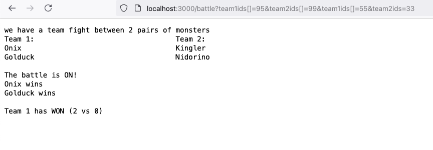
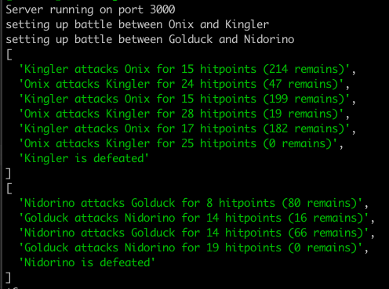

# About

This repository contains the solution to a coding task I was given for a potential 
assignment.

The requirements were

- Make an application that simulates battles between teams of Pokemons
- Short work with data from [pokedex.txt](https://raw.githubusercontent.com/Biuni/PokemonGO-Pokedex/master/pokedex.json?_sm_au_=iVVPJsWPrbV7fWT5pGsWvKttvN1NG)
- Use NodeJS and Typescript
- Have well-organized code
- Handle errors well

My application provides all of the above and also

- Proper validation of input query parameters
- Scripts to build and run the application as a Docker container 
- File-based data backend with a clean interface ready to be extended for other storage
- Developer-friendly error messages, easy to disable in production
- Text based test endpoint of the backend

# Running the project

The project requires NodeJS, npm and typescript of reasonably new version.

To build the project run

    > npm run build

To run the project

    > npm run start

To start in development watch mode, type

    > npm run dev

To build a docker image use the provided bash scripts

    > ./build_docker.sh
    ...

To then start the container type

    > ./run_docker.sh

This starts the container in the background. To end it, type

    > ./stop_docker.sh

The server starts on port 3000 by default.

The screenshot below shows running the url

    http://localhost:3000/battle?team1ids[]=95&team2ids[]=99&team1ids[]=55&team2ids=33

As can be seen, the url includes team1ids and team2ids of array form.

Feel free to play around with different IDs. If something is wrong, the web server will tell you
if you are in development mode.

For each battle the web server displays the monsters taking part and how the outcome was.
To see the exact log of how each battle was fought, look in the terminal running the server.

# Future improvements

The big one would be to separate client from server, and make the server only send JSON data to the client instead of plain text like today. The client could be a separate React application.

If this was to be a proper game, user accounts and data would need to be set up.

Probably get in some more faithful combat mechanics.

From a server perspective, server logs would need more proper management, and perhaps stored in json for Elastic etc.

The battle endpoint has not been load tested, and there is currently no limit to the team sizes which could overspend the server's resources.